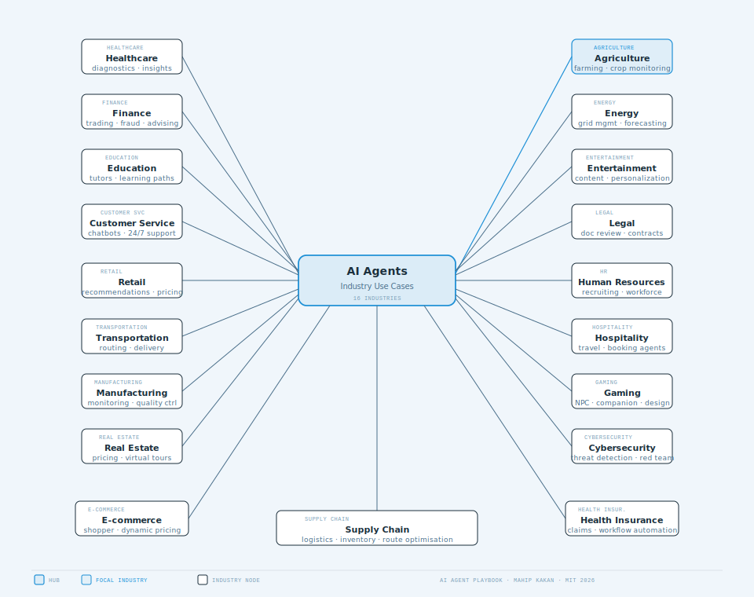

# 🤖 AI Agent Playbook

> A comprehensive, curated playbook of AI agent use cases across industries and frameworks — with a visual guide to help you pick the right agent type and get started fast.
>
> **Curated and maintained by [Mahip Kakan](https://github.com/mahip-kakan)**

---

## 📋 Table of Contents

- [How to Start — Visual Guide](#-how-to-start--visual-guide)
- [Where to Use What — Framework Selector](#-where-to-use-what--framework-selector)
- [Introduction](#-introduction)
- [Industry Use Cases](#-industry-use-cases)
- [Framework-wise Use Cases](#framework-wise-use-cases)
  - [CrewAI](#framework-crewai)
  - [AutoGen](#framework-autogen)
  - [Agno](#framework-agno)
  - [LangGraph](#framework-langgraph)
- [CrewAI + MCP Course](#-crewai--fastmcp-course)
- [Contributing](#-contributing)
- [License](#-license)

---

## 🚀 How to Start — Visual Guide

> A flowchart to help you go from idea → running AI agent in the fastest path possible.

<svg viewBox="0 0 720 580" width="720" height="580" xmlns="http://www.w3.org/2000/svg">
  <rect width="100%" height="100%" fill="#f0f6fb"/>
  <defs>
    <marker id="arr" markerWidth="8" markerHeight="6" refX="7" refY="3" orient="auto"><polygon points="0 0,8 3,0 6" fill="#4a6f8a"/></marker>
    <marker id="arr-acc" markerWidth="8" markerHeight="6" refX="7" refY="3" orient="auto"><polygon points="0 0,8 3,0 6" fill="#1e90d6"/></marker>
  </defs>
  <!-- Arrows -->
  <line x1="360" y1="52" x2="360" y2="88" stroke="#1e90d6" stroke-width="1.2" marker-end="url(#arr-acc)"/>
  <line x1="360" y1="136" x2="360" y2="172" stroke="#1e90d6" stroke-width="1.2" marker-end="url(#arr-acc)"/>
  <!-- Decision: framework known? YES left / NO right -->
  <line x1="296" y1="216" x2="160" y2="260" stroke="#4a6f8a" stroke-width="1" marker-end="url(#arr)"/>
  <rect x="246" y="228" width="28" height="12" rx="2" fill="#f0f6fb"/>
  <text x="260" y="237" fill="#4a6f8a" font-size="8" font-family="monospace" text-anchor="middle">YES</text>
  <line x1="424" y1="216" x2="560" y2="260" stroke="#4a6f8a" stroke-width="1" marker-end="url(#arr)"/>
  <rect x="446" y="228" width="24" height="12" rx="2" fill="#f0f6fb"/>
  <text x="458" y="237" fill="#4a6f8a" font-size="8" font-family="monospace" text-anchor="middle">NO</text>
  <!-- From "pick framework" → CrewAI / AutoGen / Agno / LangGraph -->
  <line x1="560" y1="308" x2="560" y2="344" stroke="#4a6f8a" stroke-width="1" marker-end="url(#arr)"/>
  <!-- Framework selector outputs all → run example -->
  <line x1="160" y1="308" x2="160" y2="420" stroke="#4a6f8a" stroke-width="1" marker-end="url(#arr)"/>
  <line x1="560" y1="392" x2="480" y2="420" stroke="#4a6f8a" stroke-width="1" marker-end="url(#arr)"/>
  <!-- Run example → Customize -->
  <line x1="360" y1="468" x2="360" y2="504" stroke="#1e90d6" stroke-width="1.2" marker-end="url(#arr-acc)"/>
  <!-- Start -->
  <rect x="276" y="16" width="168" height="36" rx="18" fill="rgba(26,46,59,0.08)" stroke="#4a6f8a" stroke-width="1"/>
  <text x="360" y="38" fill="#1a2e3b" font-size="13" font-weight="600" font-family="sans-serif" text-anchor="middle">I have an agent idea</text>
  <!-- Define use case -->
  <rect x="228" y="88" width="264" height="48" rx="6" fill="#ffffff" stroke="#1a2e3b" stroke-width="1"/>
  <rect x="236" y="94" width="72" height="12" rx="2" fill="transparent" stroke="rgba(26,46,59,0.30)" stroke-width="0.8"/>
  <text x="272" y="103" fill="rgba(26,46,59,0.7)" font-size="7" font-family="monospace" text-anchor="middle" letter-spacing="0.08em">STEP 1</text>
  <text x="360" y="122" fill="#1a2e3b" font-size="12" font-weight="600" font-family="sans-serif" text-anchor="middle">Define your use case &amp; industry</text>
  <text x="360" y="132" fill="#4a6f8a" font-size="9" font-family="monospace" text-anchor="middle">healthcare · finance · retail · etc.</text>
  <!-- Diamond: framework known? -->
  <polygon points="360,172 424,216 360,260 296,216" fill="rgba(30,144,214,0.08)" stroke="#1e90d6" stroke-width="1.2"/>
  <text x="360" y="213" fill="#1a2e3b" font-size="11" font-weight="600" font-family="sans-serif" text-anchor="middle">Framework</text>
  <text x="360" y="227" fill="#1a2e3b" font-size="11" font-weight="600" font-family="sans-serif" text-anchor="middle">in mind?</text>
  <!-- Use industry table -->
  <rect x="72" y="260" width="176" height="48" rx="6" fill="#ffffff" stroke="#1a2e3b" stroke-width="1"/>
  <text x="160" y="282" fill="#1a2e3b" font-size="11" font-weight="600" font-family="sans-serif" text-anchor="middle">Browse Industry</text>
  <text x="160" y="298" fill="#4a6f8a" font-size="9" font-family="monospace" text-anchor="middle">Use Case Table ↓</text>
  <!-- Pick framework -->
  <rect x="468" y="260" width="188" height="48" rx="6" fill="rgba(30,144,214,0.08)" stroke="#1e90d6" stroke-width="1.2"/>
  <text x="562" y="282" fill="#1a2e3b" font-size="11" font-weight="600" font-family="sans-serif" text-anchor="middle">Use Framework</text>
  <text x="562" y="298" fill="#4a6f8a" font-size="9" font-family="monospace" text-anchor="middle">Selector Guide ↓</text>
  <!-- Framework boxes -->
  <rect x="468" y="344" width="80" height="48" rx="6" fill="rgba(26,46,59,0.04)" stroke="#4a6f8a" stroke-width="0.8"/>
  <text x="508" y="371" fill="#1a2e3b" font-size="10" font-weight="600" font-family="sans-serif" text-anchor="middle">CrewAI</text>
  <rect x="556" y="344" width="80" height="48" rx="6" fill="rgba(26,46,59,0.04)" stroke="#4a6f8a" stroke-width="0.8"/>
  <text x="596" y="371" fill="#1a2e3b" font-size="10" font-weight="600" font-family="sans-serif" text-anchor="middle">AutoGen</text>
  <rect x="468" y="400" width="80" height="36" rx="6" fill="rgba(26,46,59,0.04)" stroke="#4a6f8a" stroke-width="0.8"/>
  <text x="508" y="422" fill="#1a2e3b" font-size="10" font-weight="600" font-family="sans-serif" text-anchor="middle">Agno</text>
  <rect x="556" y="400" width="80" height="36" rx="6" fill="rgba(26,46,59,0.04)" stroke="#4a6f8a" stroke-width="0.8"/>
  <text x="596" y="422" fill="#1a2e3b" font-size="10" font-weight="600" font-family="sans-serif" text-anchor="middle">LangGraph</text>
  <!-- Clone + run example -->
  <rect x="228" y="420" width="264" height="48" rx="6" fill="#ffffff" stroke="#1a2e3b" stroke-width="1"/>
  <rect x="236" y="426" width="72" height="12" rx="2" fill="transparent" stroke="rgba(26,46,59,0.30)" stroke-width="0.8"/>
  <text x="272" y="435" fill="rgba(26,46,59,0.7)" font-size="7" font-family="monospace" text-anchor="middle" letter-spacing="0.08em">STEP 2</text>
  <text x="360" y="454" fill="#1a2e3b" font-size="12" font-weight="600" font-family="sans-serif" text-anchor="middle">Clone the example repo &amp; run it</text>
  <text x="360" y="464" fill="#4a6f8a" font-size="9" font-family="monospace" text-anchor="middle">pip install · set API key · python run.py</text>
  <!-- Customize + ship -->
  <rect x="228" y="504" width="264" height="48" rx="6" fill="rgba(30,144,214,0.08)" stroke="#1e90d6" stroke-width="1.2"/>
  <rect x="236" y="510" width="72" height="12" rx="2" fill="transparent" stroke="rgba(30,144,214,0.40)" stroke-width="0.8"/>
  <text x="272" y="519" fill="rgba(30,144,214,0.8)" font-size="7" font-family="monospace" text-anchor="middle" letter-spacing="0.08em">STEP 3</text>
  <text x="360" y="542" fill="#1a2e3b" font-size="12" font-weight="600" font-family="sans-serif" text-anchor="middle">Customize &amp; ship to production</text>
  <text x="360" y="552" fill="#4a6f8a" font-size="9" font-family="monospace" text-anchor="middle">add tools · add memory · deploy</text>
</svg>

---

## 🧭 Where to Use What — Framework Selector

| Your situation | Best framework | Why |
|---|---|---|
| You need **role-based teams** — researcher, writer, reviewer | **CrewAI** | Built for multi-agent crews with defined roles and flows |
| You need **code generation + execution + debugging** loops | **AutoGen** | Microsoft's framework excels at code-running agents |
| You want **simple Python scripts** with minimal boilerplate | **Agno** | Lightweight, fast to prototype, good tool support |
| You need **stateful graphs** with conditional branching | **LangGraph** | Best for complex state machines and RAG pipelines |
| You need **RAG** (retrieval-augmented generation) | **LangGraph** | Adaptive, Corrective, Self-RAG all have official tutorials |
| You need **multi-agent collaboration** with human-in-the-loop | **AutoGen** | Native async human input + group chat support |
| You want to **connect to MCP servers** | **CrewAI + Agno** | Both have official MCP integration examples |
| You're a **beginner** picking the first framework | **CrewAI** | Most beginner-friendly, best documentation |

---

## 🧠 Introduction

AI agents are software systems that perceive their environment, reason about it, and take actions to achieve goals — often using large language models (LLMs) as their reasoning engine.

This playbook provides:
- A categorized list of industries where AI agents are making an impact
- Detailed use cases with links to open-source implementations
- Framework-wise breakdowns so you can pick the right tool for your job
- A beginner course for CrewAI + FastMCP integration

Whether you're a developer, researcher, or business professional — this is your go-to reference for AI agent inspiration and learning.

---

## 🏭 Industry Use Cases

| Use Case | Industry | Description | Code |
|---|---|---|---|
| **HIA (Health Insights Agent)** | Healthcare | Analyses medical reports and provides health insights. |  |
| **AI Health Assistant** | Healthcare | Diagnoses and monitors diseases using patient data. |  |
| **Automated Trading Bot** | Finance | Automates stock trading with real-time market analysis. |  |
| **Virtual AI Tutor** | Education | Provides personalized education tailored to users. |  |
| **24/7 AI Chatbot** | Customer Service | Handles customer queries around the clock. |  |
| **Product Recommendation Agent** | Retail | Suggests products based on user preferences and history. |  |
| **Self-Driving Delivery Agent** | Transportation | Optimizes routes and autonomously delivers packages. |  |
| **Factory Process Monitoring Agent** | Manufacturing | Monitors production lines and ensures quality control. |  |
| **Property Pricing Agent** | Real Estate | Analyzes market trends to determine property prices. |  |
| **Smart Farming Assistant** | Agriculture | Provides insights on crop health and yield predictions. |  |
| **Energy Demand Forecasting Agent** | Energy | Predicts energy usage to optimize grid management. |  |
| **Content Personalization Agent** | Entertainment | Recommends personalized media based on preferences. |  |
| **Legal Document Review Assistant** | Legal | Automates document review and highlights key clauses. |  |
| **Recruitment Recommendation Agent** | Human Resources | Suggests best-fit candidates for job openings. |  |
| **Virtual Travel Assistant** | Hospitality | Plans travel itineraries based on preferences. |  |
| **AI Game Companion Agent** | Gaming | Enhances player experience with real-time assistance. |  |
| **Real-Time Threat Detection Agent** | Cybersecurity | Identifies potential threats and mitigates attacks. |  |
| **E-commerce Personal Shopper Agent** | E-commerce | Helps customers find products they'll love. |  |
| **Logistics Optimization Agent** | Supply Chain | Plans efficient delivery routes and manages inventory. |  |
| **Vibe Hacking Agent** | Cybersecurity | Autonomous multi-agent red team testing service. |  |
| **MediSuite-AI-Agent** | Health Insurance | Automates hospital / insurance claiming workflow. |  |

---

## Framework-wise Use Cases

---

### Framework: CrewAI

| Use Case | Industry | Description | GitHub |
|---|---|---|---|
| 📧 Email Auto Responder Flow | 🗣️ Communication | Automates email responses based on predefined criteria. |  |
| 📝 Meeting Assistant Flow | 🛠️ Productivity | Assists in organizing and managing meetings. |  |
| 🔄 Self Evaluation Loop Flow | 👥 Human Resources | Facilitates self-assessment and performance reviews. |  |
| 📈 Lead Score Flow | 💼 Sales | Evaluates and scores potential leads for sales. |  |
| 📊 Marketing Strategy Generator | 📢 Marketing | Develops marketing strategies by analyzing market trends. |  |
| 📝 Job Posting Generator | 🧑‍💼 Recruitment | Creates job postings by analyzing requirements. |  |
| 🔄 Recruitment Workflow | 🧑‍💼 Recruitment | Streamlines recruitment by automating hiring tasks. |  |
| 🔍 Match Profile to Positions | 🧑‍💼 Recruitment | Matches candidate profiles to job positions. |  |
| 📸 Instagram Post Generator | 📱 Social Media | Generates and schedules Instagram posts automatically. |  |
| 🌐 Landing Page Generator | 💻 Web Development | Automates the creation of landing pages. |  |
| 🎮 Game Builder Crew | 🎮 Game Development | Assists in game development by automating creation tasks. |  |
| 💹 Stock Analysis Tool | 💰 Finance | Analyzes stock market data for financial decisions. |  |
| 🗺️ Trip Planner | ✈️ Travel | Assists in planning trips and managing itineraries. |  |
| 🎁 Surprise Trip Planner | ✈️ Travel | Plans surprise trips based on user preferences. |  |
| 📚 Write a Book with Flows | ✍️ Creative Writing | Assists authors in writing books with structured workflows. |  |
| 🎬 Screenplay Writer | ✍️ Creative Writing | Aids in writing screenplays with templates and guidance. |  |
| ✅ Markdown Validator | 📄 Documentation | Validates Markdown files for proper formatting. |  |
| 🧠 Meta Quest Knowledge | 📚 Knowledge Management | Manages knowledge related to Meta Quest. |  |
| 🤖 NVIDIA Models Integration | 🤖 AI Integration | Integrates NVIDIA AI models into workflows. |  |
| 🗂️ Prep for a Meeting | 🛠️ Productivity | Assists in preparing for meetings. |  |
| 🛠️ Starter Template | 🛠️ Development | Starter template for new CrewAI projects. |  |
| 🔗 CrewAI + LangGraph Integration | 🤖 AI Integration | Integration between CrewAI and LangGraph. |  |

---

### Framework: AutoGen

> **Code Generation, Execution, and Debugging**

| Use Case | Industry | Description | Notebook |
|---|---|---|---|
| 🤖 Automated Task Solving with Code Generation, Execution & Debugging | 💻 Software Development | Automated task-solving by generating, executing, and debugging code. |  |
| 🧑‍💻 Code Generation and QA with Retrieval Augmented Agents | 💻 Software Development | Generates code and answers questions using retrieval-augmented methods. |  |
| 🧠 Code Generation with Qdrant-based Retrieval | 💻 Software Development | Utilizes Qdrant for enhanced retrieval-augmented agent performance. |  |

> **Multi-Agent Collaboration**

| Use Case | Industry | Description | Notebook |
|---|---|---|---|
| 🤝 Group Chat (3 members, 1 manager) | 🤝 Collaboration | Group task-solving via multi-agent collaboration. |  |
| 📊 Data Visualization by Group Chat | 📊 Data Analysis | Multi-agent collaboration to create data visualizations. |  |
| 🧩 Complex Task Solving (6 members, 1 manager) | 🤝 Collaboration | Solves complex tasks collaboratively with a larger group. |  |
| 🧑‍💻 Coding & Planning Agents | 🛠️ Planning & Development | Combines coding and planning agents for task solving. |  |
| 📐 Transition Paths Specified in a Graph | 🤝 Collaboration | Uses predefined transition paths in a graph. |  |
| 🧠 SocietyOfMindAgent Inner-Monologue | 🧠 Cognitive Sciences | Simulates inner-monologue for problem-solving. |  |
| 🔧 Custom Speaker Selection Function | 🤝 Collaboration | Custom function for speaker selection in group chats. |  |

> **Sequential & Nested Chats**

| Use Case | Industry | Description | Notebook |
|---|---|---|---|
| 🔄 Sequential Tasks (Single Agent) | 🔄 Workflow Automation | Automates sequential task-solving with a single initiating agent. |  |
| ⏳ Async Sequential Tasks | 🔄 Workflow Automation | Asynchronous task-solving in a sequence of chats. |  |
| 🤝 Sequential Tasks (Different Agents) | 🔄 Workflow Automation | Sequential task-solving with different initiating agents. |  |
| 🧠 Nested Chats | 🧠 Problem Solving | Nested chats for hierarchical problem solving. |  |
| 🔄 Sequence of Nested Chats | 🧠 Problem Solving | Sequential task-solving using nested chats. |  |
| 🏭 OptiGuide — Supply Chain Nested Chats | 🏭 Supply Chain | Supply chain optimization with nested chats + safeguard agent. |  |
| ♟️ Conversational Chess with Nested Chats | 🎮 Gaming | Conversational chess with integrated tools. |  |

> **Tools & Applications**

| Use Case | Industry | Description | Notebook |
|---|---|---|---|
| 🌐 Web Search | 🔍 Information Retrieval | Searches the web to gather information for tasks. |  |
| 📚 RAG Group Chat | 🤝 Collaboration | Group chat with Retrieval Augmented Generation. |  |
| 🔊 Agent Chat with Whisper | 🎙️ Audio Processing | Transcription and translation using Whisper. |  |
| 📊 Natural Language to SQL | 💾 Database Management | Converts natural language into SQL queries. |  |
| 🕸️ Web Scraping with Apify | 🌐 Data Gathering | Web scraping techniques with Apify. |  |
| 🤖 AutoAnny Discord Bot | 💬 Communication | Discord bot built using AutoGen. |  |
| 🔄 Automated Continual Learning | 📊 Machine Learning | Continuously learns from new data inputs. |  |

> **Human-in-the-Loop & Teaching**

| Use Case | Industry | Description | Notebook |
|---|---|---|---|
| 💬 ChatGPT Style Example | 🧠 Conversational AI | Simple conversational example in ChatGPT style. |  |
| 🤖 Code Gen with Human Feedback | 💻 Software Development | Code generation with human feedback in the loop. |  |
| 📘 Teach Agents New Skills | 🎓 Education & Training | Teaching new skills to agents via automated chats. |  |
| 🔄 Agent Optimizer | 🛠️ Optimization | Train agents effectively in an agentic manner. |  |

> **Multi-Agent with OpenAI Assistants**

| Use Case | Industry | Description | Notebook |
|---|---|---|---|
| 🌟 Hello-World with OpenAI Assistant | 🤖 Conversational AI | Basic example chatting with OpenAI Assistant in AutoGen. |  |
| 🧠 OpenAI Assistant as Code Interpreter | 💻 Software Development | OpenAI Assistant as a code interpreter in chats. |  |
| 🔍 OpenAI Assistant with Retrieval | 📚 Information Retrieval | Retrieval-augmented conversations with OpenAI Assistant. |  |
| 🤝 OpenAI Assistant in Group Chat | 🤝 Collaboration | OpenAI Assistant collaborating with other agents. |  |

> **Multimodal & Evaluation**

| Use Case | Industry | Description | Notebook |
|---|---|---|---|
| 🎨 Multimodal Agent with DALLE + GPT-4V | 🖼️ Multimedia AI | Combines DALLE and GPT-4V for multimodal communication. |  |
| 🖌️ Multimodal Agent with Llava | 📷 Image Processing | Enables multimodal conversations with image processing. |  |
| 📜 Long Context Handling | 🧠 AI Capability | Techniques for handling long context in AI workflows. |  |
| 📊 AgentEval: Multi-Agent Assessment | 📈 Performance Evaluation | Evaluating and assessing LLM-based applications. |  |
| 🏗️ Auto-Build Multi-Agent System | 🤖 AI Development | Automatically builds multi-agent systems with AgentBuilder. |  |
| 📊 Track LLM Calls with AgentOps | 📈 Monitoring | Monitor LLM interactions, tool usage, and errors. |  |

---

### Framework: Agno

| Use Case | Industry | Description | Code |
|---|---|---|---|
| 🤖 Support Agent | 💻 Software Development | Helps developers with the Agno framework with real-time answers and code examples. |  |
| 🎥 YouTube Agent | 📺 Media & Content | Analyzes YouTube videos with summaries, timestamps, and content breakdowns. |  |
| 📊 Finance Agent (Thinking) | 💼 Finance | Real-time stock market insights with analyst recommendations and deep-dives. |  |
| 📚 Study Partner | 🎓 Education | Assists learning by finding resources and creating study plans. |  |
| 🛍️ Shopping Partner Agent | 🏬 E-commerce | Product recommender based on preferences from Amazon, Flipkart, etc. |  |
| 🎓 Research Scholar Agent | 🧠 Education / Research | Advanced academic searches, publication analysis, and structured reports. |  |
| 🧠 Research Agent | 🗞️ Media & Journalism | Web search + professional journalistic writing, NYT-style reports. |  |
| 🍳 Recipe Creator | 🍽️ Food & Culinary | Personalized recipe recommendations based on ingredients and preferences. |  |
| 🗞️ Finance Agent | 💼 Finance | Real-time stock data, analyst insights, and market news. |  |
| 🧠 Financial Reasoning Agent | 📈 Finance | Claude-3.5 Sonnet-based agent for stock analysis with Yahoo Finance data. |  |
| 🤖 README Generator Agent | 💻 Software Dev | Generates high-quality READMEs for GitHub repos using metadata. |  |
| 🎬 Movie Recommendation Agent | 🎥 Entertainment | Personalized movie recommendations using Exa and GPT-4o. |  |
| 🔍 Media Trend Analysis Agent | 📰 Media & News | Analyzes emerging trends from digital platforms. |  |
| ⚖️ Legal Document Analysis Agent | 🏛️ Legal Tech | Analyzes legal documents from PDF URLs with vector embeddings. |  |
| 🤔 DeepKnowledge | 🧠 Research | Iterative knowledge base search with sub-question decomposition. |  |
| 📚 Book Recommendation Agent | 🧠 Publishing & Media | Personalized book suggestions using literary data and reviews. |  |
| 🏠 MCP Airbnb Agent | 🛎️ Hospitality | Searches Airbnb listings with filters using MCP and Llama 4. |  |

---

### Framework: LangGraph

| Use Case | Industry | Description | Code |
|---|---|---|---|
| 🤖 Chatbot Simulation Evaluation | 💬 AI / QA | Simulate user interactions to evaluate chatbot performance. |  |
| 🧠 Information Gathering via Prompting | 🧠 Research | LangGraph workflow for structured information gathering. |  |
| 🧠 Code Assistant | 💻 Software Development | Graph-based agent for code generation, error checking, and refinement. |  |
| 🧑‍💼 Customer Support Agent | 🧑‍💼 Customer Support | Graph-based agent for handling customer inquiries. |  |
| 🔁 Extraction with Retries | 🧠 Data Extraction | Retry mechanisms for robust data extraction. |  |
| 🧠 Multi-Agent Workflow (Supervisor) | 🧠 Workflow Orchestration | Supervisor agent orchestrating multiple specialized agents. |  |
| 🧠 Hierarchical Agent Teams | 🧠 Workflow Orchestration | Top-level supervisor delegating to specialized sub-agents. |  |
| 🤝 Multi-Agent Collaboration | 🧠 Workflow Orchestration | Multiple specialized agents collaborating on complex tasks. |  |
| 🧠 Plan-and-Execute Agent | 🧠 Workflow Orchestration | Agent that plans a multi-step plan then executes sequentially. |  |
| 🧠 SQL Agent | 🧠 Database Interaction | Agent that answers questions about a SQL database. |  |
| 🧠 Reflection Agent | 🧠 Workflow Orchestration | Agent that critiques and revises its own outputs. |  |
| 🧠 Reflexion Agent | 🧠 Workflow Orchestration | Agent that reflects on actions for iterative improvement. |  |
| 🧠 Adaptive RAG | 🧠 Information Retrieval | Dynamic retrieval process that adjusts based on query complexity. |  |
| 🧠 Adaptive RAG (Local) | 🧠 Information Retrieval | Adaptive RAG with local models for offline/private environments. |  |
| 🤖 Agentic RAG | 🤖 Intelligent Agents | Agent that determines the best retrieval strategy before responding. |  |
| 🤖 Agentic RAG (Local) | 🤖 Intelligent Agents | Agentic RAG extended to local environments. |  |
| 🧠 Corrective RAG (CRAG) | 🧠 Information Retrieval | Evaluates and refines retrieved documents before generation. |  |
| 🧠 Corrective RAG (Local) | 🧠 Information Retrieval | Corrective RAG using local resources for offline evaluation. |  |
| 🧠 Self-RAG | 🧠 Information Retrieval | System reflects on responses and retrieves more if necessary. |  |
| 🧠 Self-RAG (Local) | 🧠 Information Retrieval | Self-RAG using local models and data sources. |  |

---

## 📖 CrewAI + FastMCP Course

A beginner course for integrating CrewAI with FastMCP servers. Three lessons covering setup, integration, and advanced multi-agent patterns.

👉 [View the course →](crewai_mcp_course/README.md)

---

## 🤝 Contributing

Contributions are welcome! See [CONTRIBUTION.md](CONTRIBUTION.md) for guidelines on adding new use cases, frameworks, or improving existing entries.

1. Fork the repository
2. Add your use case or improvement
3. Submit a pull request

---

## 📜 License

MIT License © 2026 [Mahip Kakan](https://github.com/mahip-kakan) — see [LICENSE](LICENSE) for details.

---

  Curated with ❤️ by <a href="https://github.com/mahip-kakan">Mahip Kakan</a> · Star ⭐ if you find it useful · Share with your network

